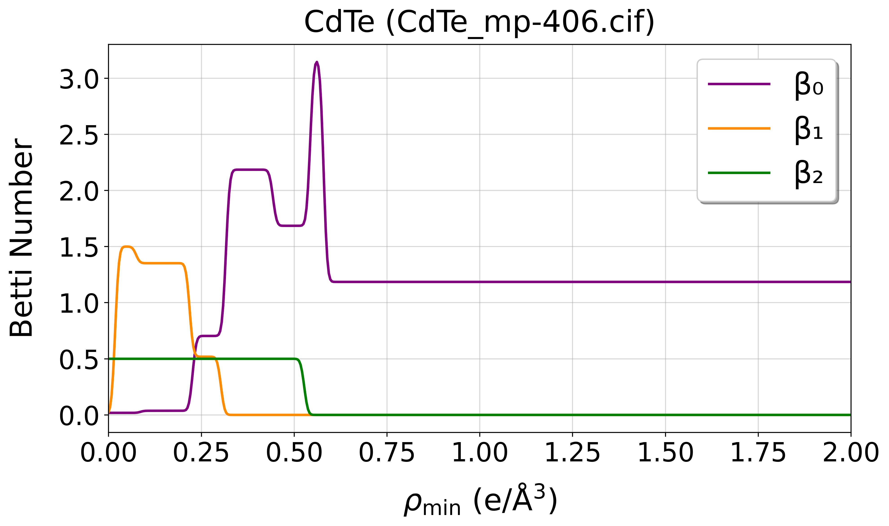

# CrysTopo
A toolkit for analyzing DFT-computed charge densities using persistent homology and machine learning.

## What is CrysTopo?
CrysTopo is a Python package that combines crystallographic topology analysis with machine learning to:
- Generate Betti curves from crystal structures and charge densities
- Classify materials by structure type, metal/insulator properties, and thermodynamic stability
- Create spectral embeddings for material analysis

## Installation
1. Clone the repository:
```bash
git clone https://github.umn.edu/bartel-group/crystopo.git
cd crystopo
```

2. Install the package:
```bash
pip install .
```

## Materials Project API Key
For features that require data from the Materials Project (MP), you'll need to include your MP API key in the configuration file. You can obtain an API key by:

1. Creating an account at [Materials Project](https://materialsproject.org/)
2. Going to your dashboard and copying your API key
3. Including it in your configuration file as `"mp_api_key": "YOUR_API_KEY_HERE"`

The API key is required for:
- Any tasks using the "mp_ids" or "mp_query" methods
- Stability classification (except when using local files)

## Quick Start
CrysTopo uses JSON configuration files to control its operations. To run an analysis:
```bash
python runner.py config.json
```

With the default ```config.json``` file provided in the repository, running this command should return:


Custom analyses may be run by modifying the ```config.json``` to suit one of the tasks described below.

## Features
### 1. Betti Curve Generation
Generate Betti curves using any of these three methods:

#### Local Files Method
```json
{
    "task": "betti_calculation",
    "method": "local_files",
    "structure_files": ["path/to/structure1.cif", ...],
    "charge_density_files": ["path/to/density1.pickle", ...],
    "output_dir": "output/betti_curves",
    "visualize": true
}
```

#### Materials Project ID Method
```json
{
    "task": "betti_calculation",
    "method": "mp_ids",
    "mp_api_key": "YOUR_API_KEY_HERE",
    "mpids": ["mp-22862", "mp-406"],
    "output_dir": "output/mp_curves",
    "visualize": true
}
```

#### Structure Type Query Method
```json
{
    "task": "betti_calculation",
    "method": "mp_query",
    "mp_api_key": "YOUR_API_KEY_HERE",
    "label": "rocksalt",
    "formula_pattern": "*1*1",    # For AB compounds
    "space_group": 225,
    "sample_size": 5,    # To sample only a subset
    "output_dir": "output/rocksalt",
    "visualize": true
}
```

### 2. Material Classification
CrysTopo supports three types of classification:

#### Structure Type Classification
Classify materials based on their crystal structure:
```json
{
    "task": "structure_classification",
    "method": "mp_ids",
    "mp_api_key": "YOUR_API_KEY_HERE",
    "structures": {
        "rocksalt": ["mp-22862", "mp-19006", "mp-22898", "mp-1265", "mp-19009"],
        "zincblende": ["mp-406", "mp-10695", "mp-1190", "mp-2691", "mp-2172"]
    },
    "model_path": "models/structure_classifier.joblib"
}
```

#### Metal/Insulator Classification
Determine whether materials are metallic or insulating:
```json
{
    "task": "metal_classification",
    "method": "mp_ids",
    "mp_api_key": "YOUR_API_KEY_HERE",
    "mpids": ["mp-541404", "mp-19006", "mp-72", "mp-22862", "mp-13"],
    "model_path": "models/metal_classifier.joblib"
}
```

#### Thermodynamic Stability Classification
Predict thermodynamic stability:
```json
{
    "task": "stability_classification",
    "method": "mp_ids",
    "mp_api_key": "YOUR_API_KEY_HERE",
    "mpids": ["mp-149", "mp-168", "mp-1204356", "mp-66", "mp-25279", "mp-624689"],
    "model_path": "models/stability_classifier.joblib"
}
```

### 3. Unsupervised Learning
Create 2D spectral embeddings from Betti curves:
```json
{
    "task": "spectral_embedding",
    "method": "mp_ids",
    "mp_api_key": "YOUR_API_KEY_HERE",
    "mpids": ["mp-541404", "mp-19006", "mp-72", "mp-22862", "mp-13"],
    "colorbar_label": "Index"
}
```

## Benchmarking
CrysTopo includes a benchmarking script (`benchmark.py`) that compares its performance against traditional descriptors:
- SOAP (Smooth Overlap of Atomic Positions)
- SkipAtom feature embeddings
- Matminer site statistics
- CHGNet feature embeddings

Example benchmark configuration:
```json
{
    "task": "metal_classification",
    "method": "mp_ids",
    "mp_api_key": "YOUR_API_KEY_HERE",
    "descriptor_type": "soap",
    "mpids": ["mp-541404", "mp-19006", "mp-72", "mp-22862", "mp-13", "mp-22905", "mp-131"],
    "model_path": "models/benchmark_classifier.joblib"
}
```

Available descriptor types:
- `soap`
- `skipatom`
- `matminer`
- `chgnet`
